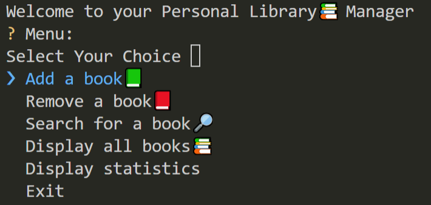
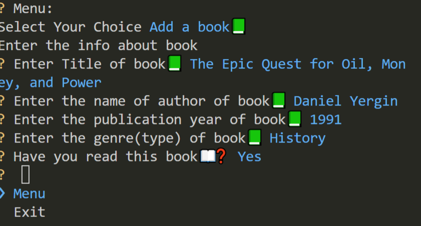

# Personal Library Manager 📚

Welcome to your Personal Library Manager! This program helps you keep track of all your books. You can add new books, remove books you've finished, search for books, and even see some cool statistics about your reading.

## What it does

This program lets you:

* **Add books:** Enter the title, author, publication year, genre, and whether you've read it.
* **Remove books:** Take books off your list when you're done or if you don't want them anymore.
* **Search for books:** Find books by title or author.
* **Display all books:** See a list of all the books in your library.
* **Display statistics:** Get a summary of how many books you have and what percentage you've read.

## How to use it

1.  **Run the program:** Just run the Python file.
2.  **Follow the menu:** The program will show you a menu with options.
3.  **Choose an option:** Type the number or select the option you want and press Enter.
4.  **Answer the questions:** The program will ask you questions based on your choice.
5.  **Enjoy!** Keep track of your awesome book collection.

## Example

Here's what it might look like when you run the program:




If you choose "Add a book📗", it will ask you questions like:




Then it will add the book to your library!

## Important Notes

* This program uses the `InquirerPy` library. Make sure you have it installed. You can install it by running:
    ```bash
    pip install inquirerpy
    ```

## Have fun!

I hope you enjoy using Personal Library Manager.